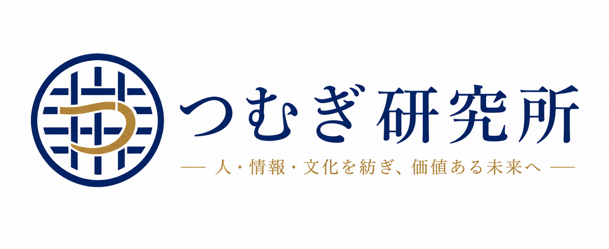

# tsumugi-labo.github.io
つむぎ研究所 コーポレートサイト
# つむぎ研究所（Tsumugi Labo）

> 人・情報・文化を紡ぎ、価値ある未来へ。

つむぎ研究所は、Web制作、デジタルアーカイブ、AI活用、地域文化の継承をテーマに活動するプロジェクトです。

## Website

https://tsumugi-labo.github.io

## Projects

- コーポレートサイト
- Family Archive
- 臼杵文化アーカイブ
- 高田馬場ランチマップ
- Web制作・UI/UXデザイン

## Technologies

- HTML5
- CSS3
- GitHub Pages
- Git
- Penpot
- Adobe Illustrator
- Photoshop
- AI Tools (ChatGPT / Gemini / Claude)

---

  

# つむぎ研究所（Tsumugi Labo）
© Tsumugi Labo
